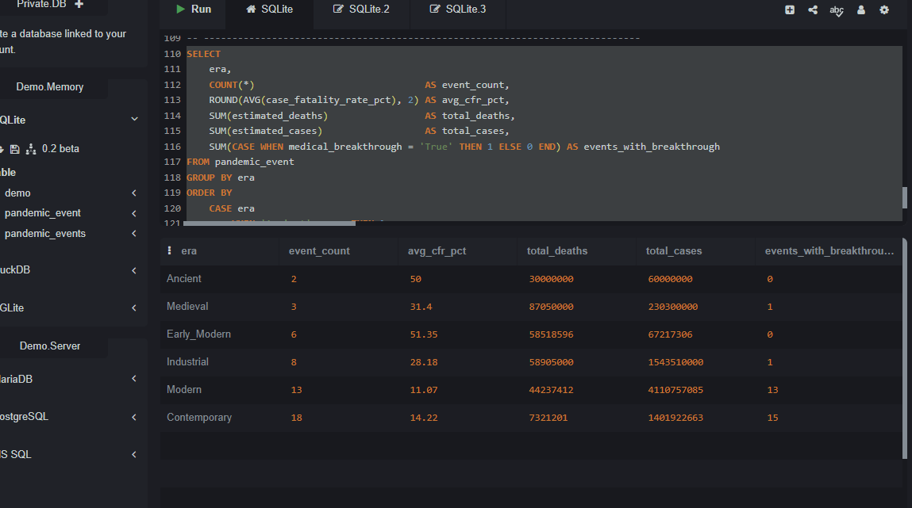
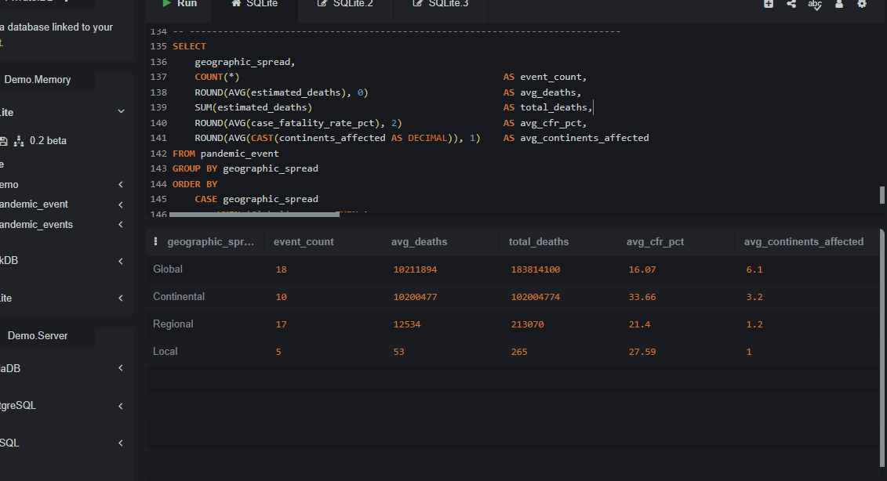
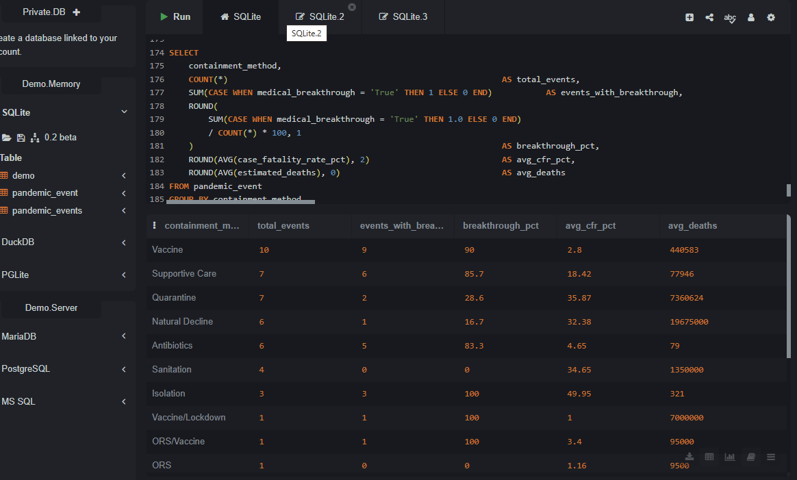
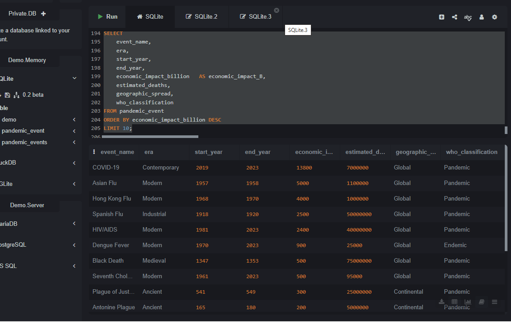
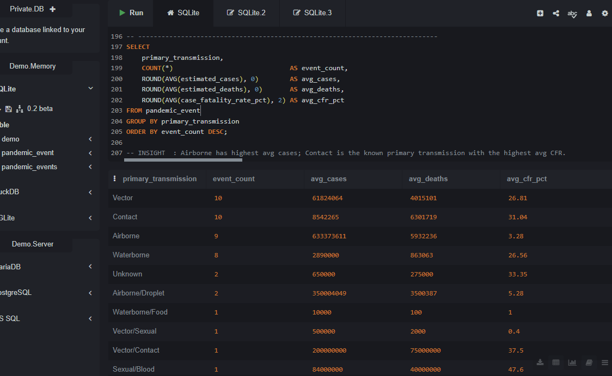

# ANALYSIS OF HISTORICAL PANDEMICS EPIDEMICS
## INTRODUCTION
This report analyzes a historical dataset of 50 documented pandemics, epidemics, outbreaks, and endemic infectious diseases spanning from the 6th century (Plague of Justinian, 541 AD) through the contemporary era (2023). It examines mortality patterns, pathogen characteristics, geographic spread, transmission routes, containment strategies, economic consequences, and the role of medical breakthroughs. The goal is to provide actionable insights for public health professionals, epidemiologists, policymakers, and researchers who seek to understand how humanity has historically responded to infectious disease threats and how modern preparedness can be improved.

## ABOUT THE DATASET
The [dataset](https://drive.google.com/file/d/1YM2af5YHrEZUfQgurKVboGcqlbHDUgyK/view?usp=drivesdk) contains 50 records with the key columns as described in the figure below;

## PROBLEM STATEMENT
Using this historical dataset of pandemic events, the analysis addresses the following questions:
-	What are the deadliest pandemics in recorded history, and what factors drove their high mortality?
-	How have case fatality rates (CFR) changed across historical eras as medicine and public health advanced?
-	Which pathogens (viral vs. bacterial) have posed the greatest global threat?
-	What containment strategies have been most effective, and how does medical innovation correlate with outcomes?
-	What is the economic cost of pandemics, and which events have been most financially devastating?
-	How do geographic spread and transmission routes relate to overall mortality?

## INSIGHTS
1. Scale of Human Impact

   Across the 50 events in the dataset, the cumulative estimated toll is staggering:
- Total estimated deaths: 286,032,209 (approximately 286 million)
- Total estimated cases: 7,413,707,054 (approximately 7.4 billion case-events)
- The overall average case fatality rate across all events stands at 22.55%.

2. Top 10 Deadliest Events

This table ranks the most lethal pandemic events by estimated deaths.
- The Black Death remains the single deadliest event in the dataset with 75 million deaths.
- Smallpox in the Americas records the highest CFR at 93.3%, reflecting its devastating impact.
- Notably, COVID-19 — despite a relatively low CFR of 1.0% — ranks 7th.

3. Pathogen Type Analysis

Viruses are slightly more prevalent (52%, 26 events) than bacteria (44%, 22 events), with 2 events classified as unknown pathogens.

Despite their similar frequencies, their impact profiles differ:
- Bacterial pathogens: Average CFR of 22.55%.
- Viral pathogens: Average CFR of 21.72%.
- Unknown pathogens: Highest average CFR at 33.35%, reflecting events where no specific organism was ever conclusively identified.

60% of all events (30 out of 50) were associated with a medical breakthrough.

4. Case Fatality Rates Across Eras

One of the most compelling trends in the dataset is the decline in average CFR over historical eras.

The data reveals a clear long-term improvement in human survival outcomes;
- Early Modern era events recorded the highest average CFR (51.35%).
- The Industrial era (28.18%).
- The Modern era (11.07%) and Contemporary era (14.22%)

This reflect gradual improvement despite a slight uptick in Contemporary CFR.

5. WHO Classification & Spread

The 50 events are distributed across WHO classifications as follows:
- Pandemic: 21 events (42%) — global or near-global reach
- Epidemic: 20 events (40%) — significant regional or continental spread
- Outbreak: 6 events (12%) — localized high-impact events
- Endemic: 3 events (6%) — persistent low-level disease burden (Dengue, Polio, Rocky Mountain Spotted Fever).

Geographic spread analysis shows that Global-spread events (18 events, 36%) produce substantially higher average mortality (10.2 million deaths per event) compared to non-global events, confirming that geographic reach is a key amplifier of total mortality.

6. Containment Methods & Medical Breakthroughs

The most frequently employed containment strategies and their association with medical breakthroughs are detailed in the figure above.

- Vaccine-based containment is both the most common modern strategy (10 events) and one of the most closely linked to medical breakthroughs (90%).
- Antibiotics similarly show high breakthrough association (83%).
- In contrast, strategies like Sanitation (4 events) and Natural Decline (6 events) show 0% and 17% breakthrough association respectively.
- Isolation-based containment achieves 100% breakthrough linkage in 3 events, suggesting targeted isolation combined with research yields rapid medical advances.

7. Economic Impact

The financial cost of pandemics has escalated dramatically in the modern era

- COVID-19's economic impact of $13,800 billion dwarfs all historical precedents, being nearly 2.8 times the combined impact of the next three most costly events (Asian Flu $5,000B, Hong Kong Flu $4,000B, Spanish Flu $2,500B).
- The difference reflects not only greater global economic integration but also the extensive non-pharmaceutical interventions.
- Ancient and Medieval events, while devastating in human terms, show lower economic impact figures.

8. Transmission Routes

The dataset records 14 distinct primary transmission categories. The leading routes are:
- Vector-borne: 10 events (20%)
- Contact-based: 10 events (20%)
- Airborne: 9 events (18%)
- Waterborne: 8 events (16%)
- Airborne/Droplet hybrid: 2 events (4%)

Airborne pathogens consistently generate the highest case volumes, while contact-based and vector-borne pathogens tend to produce higher per-case fatality rates.

## RECOMMENDATIONS
For Public Health Authorities
- Accelerate vaccine development pipelines: The data confirms vaccines are the most effective containment tool with a 90% medical breakthrough association. Investment in rapid-response vaccine platforms (e.g., mRNA technology) should be prioritized for novel pathogen threats.
- Strengthen global surveillance for airborne and vector-borne pathogens, which together account for 38% of all events and have the highest case volumes.
- Maintain robust stockpiles of antibiotics for bacterial outbreak scenarios.

For Epidemiologists & Researchers
- Focus research on high-CFR low-spread pathogens (Nipah: 91.3% CFR; H5N1: 52.6% CFR): while currently regional, spillover events could become catastrophic with increased human-animal interface.
- Investigate the 6 events attributable to natural decline as baseline comparators to measure the true impact of medical interventions.
- Monitor endemic diseases (Dengue, Rocky Mountain Spotted Fever) for potential expansion driven by climate change and habitat encroachment.

For Policymakers & Economists
- Establish international pandemic financing frameworks to ensure rapid resource mobilization in lower-income origin regions, reducing the risk of regional outbreaks escalating to global pandemics.

## CONCLUSION
- The pandemic dataset reveals a complex but ultimately optimistic trajectory for humanity's capacity to manage infectious disease. While pre-modern eras were defined by catastrophic mortality — the Black Death claiming 75 million lives, the Plague of Justinian killing half the populations of entire cities — the Modern and Contemporary eras demonstrate the transformative power of science, sanitation, and coordinated public health responses.

- Case fatality rates have declined from an average of 50% in the Early Modern era to less than 15% in the Modern era. Vaccines and antibiotics have achieved near-universal association with medical breakthroughs in events where they were applied. The rapid development and deployment of COVID-19 vaccines represents the culmination of centuries of accumulated scientific knowledge.

- Nevertheless, COVID-19 serves as a stark reminder that the economic and social cost of pandemics has never been higher. At $13,800 billion, its financial impact exceeds the entire history of recorded pandemic economics combined. The emergence of high-CFR pathogens such as Nipah (91.3%) and H5N1 (52.6%) in the Contemporary era underscores that risk has not been eliminated — only better managed. The central challenge for the 21st century is translating this improved scientific capacity into equitable, rapid, and globally coordinated response systems that can protect all populations regardless of geography or income.

