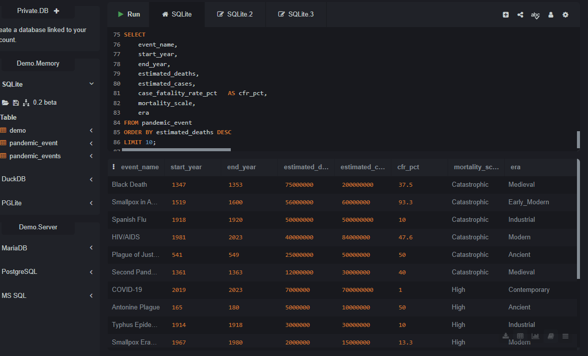
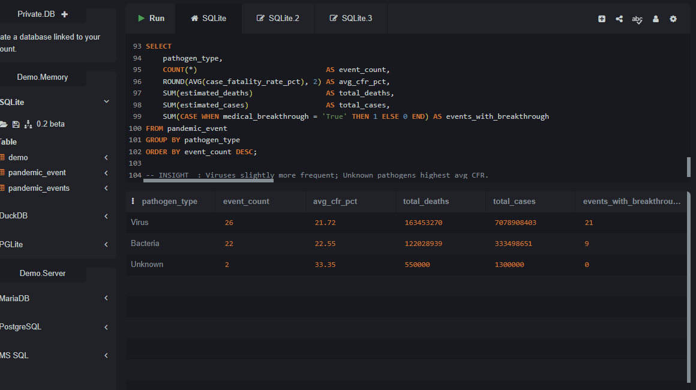

# ANALYSIS OF HISTORICAL PANDEMICS EPIDEMICS
## INTRODUCTION
This report analyzes a historical dataset of 50 documented pandemics, epidemics, outbreaks, and endemic infectious diseases spanning from the 6th century (Plague of Justinian, 541 AD) through the contemporary era (2023). It examines mortality patterns, pathogen characteristics, geographic spread, transmission routes, containment strategies, economic consequences, and the role of medical breakthroughs. The goal is to provide actionable insights for public health professionals, epidemiologists, policymakers, and researchers who seek to understand how humanity has historically responded to infectious disease threats and how modern preparedness can be improved.

## ABOUT THE DATASET
The [dataset](https://drive.google.com/file/d/1YM2af5YHrEZUfQgurKVboGcqlbHDUgyK/view?usp=drivesdk) contains 50 records with the key columns as described in the figure below;

## PROBLEM STATEMENT
Using this historical dataset of pandemic events, the analysis addresses the following questions:
-	What are the deadliest pandemics in recorded history, and what factors drove their high mortality?
-	How have case fatality rates (CFR) changed across historical eras as medicine and public health advanced?
-	Which pathogens (viral vs. bacterial) have posed the greatest global threat?
-	What containment strategies have been most effective, and how does medical innovation correlate with outcomes?
-	What is the economic cost of pandemics, and which events have been most financially devastating?
-	How do geographic spread and transmission routes relate to overall mortality?

## INSIGHTS
1. Scale of Human Impact

   Across the 50 events in the dataset, the cumulative estimated toll is staggering:
- Total estimated deaths: 286,032,209 (approximately 286 million)
- Total estimated cases: 7,413,707,054 (approximately 7.4 billion case-events)
- The overall average case fatality rate across all events stands at 22.55%.

2. Top 10 Deadliest Events

This table ranks the most lethal pandemic events by estimated deaths.
- The Black Death remains the single deadliest event in the dataset with 75 million deaths.
- Smallpox in the Americas records the highest CFR at 93.3%, reflecting its devastating impact.
- Notably, COVID-19 — despite a relatively low CFR of 1.0% — ranks 7th.

3. Pathogen Type Analysis

Viruses are slightly more prevalent (52%, 26 events) than bacteria (44%, 22 events), with 2 events classified as unknown pathogens.

Despite their similar frequencies, their impact profiles differ:
- Bacterial pathogens: Average CFR of 22.55%.
- Viral pathogens: Average CFR of 21.72%.
- Unknown pathogens: Highest average CFR at 33.35%, reflecting events where no specific organism was ever conclusively identified.

60% of all events (30 out of 50) were associated with a medical breakthrough.
