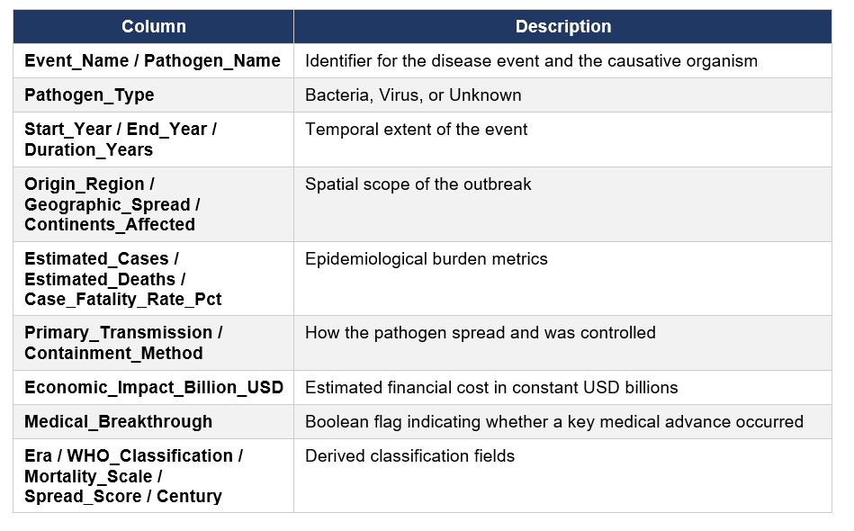

# ANALYSIS OF HISTORICAL PANDEMICS EPIDEMICS
## INTRODUCTION
This report analyzes a historical dataset of 50 documented pandemics, epidemics, outbreaks, and endemic infectious diseases spanning from the 6th century (Plague of Justinian, 541 AD) through the contemporary era (2023). It examines mortality patterns, pathogen characteristics, geographic spread, transmission routes, containment strategies, economic consequences, and the role of medical breakthroughs. The goal is to provide actionable insights for public health professionals, epidemiologists, policymakers, and researchers who seek to understand how humanity has historically responded to infectious disease threats and how modern preparedness can be improved.

## ABOUT THE DATASET
The [dataset](https://drive.google.com/file/d/1YM2af5YHrEZUfQgurKVboGcqlbHDUgyK/view?usp=drivesdk) contains 50 records with the key columns as described in the figure below;

